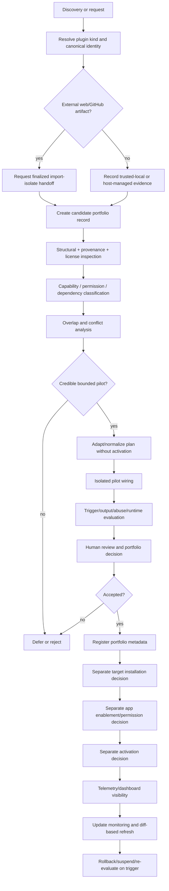

# Plugin Portfolio Methodology

## Authority and status

This document is the repository-owned methodology for representing and governing **plugins as portfolio entities**. It answers issue #59 and defines boundaries, records, lifecycle states, intake/update rules, dashboard requirements, and the `plugin-eval` pilot disposition.

It does **not** authorize plugin installation, workspace enablement, app access, activation, external acquisition, or execution. Existing owners remain authoritative:

- external web/GitHub acquisition: [`import-isolate-handoff.md`](import-isolate-handoff.md);
- canonical Agent Skills: [`skill-package-standard.md`](../standards/skill-package-standard.md);
- security/admission: [`skill-adoption-security-standard.md`](../security/skill-adoption-security-standard.md);
- behavioral evidence: [`skill-evaluation-standard.md`](../testing/skill-evaluation-standard.md);
- host integration: [`skill-runtime-adapters.md`](skill-runtime-adapters.md).

The checked-in source register entry `OA-07` is the product-source baseline for OpenAI plugin semantics. A live documentation check on 2026-08-16 found no conflict with that registered summary; no external source package or web artifact was imported into repository authority by this investigation.

## Decision summary

1. **A plugin is a portfolio/distribution object, not a skill subtype.** It may package one or more skills and may depend on host apps, app templates, MCP/configuration, local tooling, or other runtime components.
2. **Skills remain the portable instruction unit.** A plugin-provided skill that becomes repository-owned still follows the existing canonical skill lifecycle; plugin membership never bypasses skill admission.
3. **Apps/integrations remain permission-bearing host objects.** Plugin installation and app availability/permissions are separate states. A plugin record may reference an app but does not grant access to it.
4. **Runtime adapters remain repository integration code.** They map accepted portable or portfolio state to a target; they are not plugins and must not become a second plugin catalogue.
5. **External dependencies remain dependencies.** Executables, libraries, MCP servers, or services used by a plugin are recorded and evaluated separately from plugin identity.
6. **Portfolio acceptance is not installation or activation.** Repository review may accept a plugin as a governed candidate or supported portfolio item while keeping it uninstalled, unavailable, or inactive on every target.
7. **Updates are explicit diffs from the last accepted immutable baseline.** No plugin auto-syncs from a mutable upstream or host directory.

## Entity boundaries

| Entity | Owns | Does not own |
|---|---|---|
| Skill | Portable `SKILL.md` workflow, references, scripts/assets when admitted | Host installation, app authorization, plugin distribution identity |
| Plugin | Bundle identity, composition, distribution/update lineage, target requirements | Canonical skill admission, app/provider authorization |
| App/integration | Connection to provider data/actions and host permission surface | Plugin portfolio acceptance or skill content |
| App template | Host setup recipe for creating/configuring an app | Runtime data access before the resulting app is published/authorized |
| Runtime adapter | Mapping accepted repository state to one host | Source provenance, canonical identity, repository approval |
| External dependency | Executable/library/service/MCP/runtime requirement | Plugin or skill lifecycle authority |

A single user workflow may involve several entities. Keep their identities and decisions independently auditable.

## Portfolio state model

A plugin record uses independent state dimensions instead of one overloaded `status`:

- `portfolio_status`: `candidate | assessed | pilot_ready | accepted | deferred | rejected | suspended`;
- `source_status`: `unverified | handoff_pending | verified | stale | unavailable`;
- `evaluation_status`: `not_started | partial | passed | failed | deferred | stale`;
- per-target `installation_status`: `not_observed | not_installed | installed | unavailable | disabled`;
- per-target `activation_status`: `not_observed | inactive | active | blocked`;
- per-app `access_status`: host-observed state only, never inferred from plugin installation.

Rules:

- `accepted` requires an immutable verified source baseline and reviewable evaluation evidence.
- `installed` does not imply `accepted`.
- `accepted` does not imply `installed` or `active`.
- app access cannot be inferred from plugin or skill state.
- `suspended` blocks repository-supported use regardless of prior evaluation.

## Proposed non-runtime record

Do not create this schema or directory in the investigation change. The first implementation slice should introduce a machine-enforced record under a **non-discovery** root such as `portfolio/plugins/<plugin-id>/plugin-record.json`.

Minimum logical model:

```json
{
  "schema_version": 1,
  "plugin_id": "plugin-eval",
  "display_name": "Plugin Eval",
  "plugin_kind": "codex-plugin",
  "portfolio_status": "deferred",
  "source": {
    "provenance_type": "import-isolate | trusted-local | host-managed",
    "owner": null,
    "canonical_uri": null,
    "version": null,
    "immutable_revision": null,
    "retrieved_at": null,
    "artifact_sha256": null,
    "license_or_terms": null,
    "handoff": null
  },
  "contents": {
    "skills": [],
    "apps": [],
    "app_templates": [],
    "mcp_or_tooling": [],
    "resources": []
  },
  "capabilities": {
    "filesystem_read": [],
    "filesystem_write": [],
    "process_execution": false,
    "network": false,
    "credentials": false,
    "external_mutation": false
  },
  "dependencies": [],
  "targets": [],
  "evaluation": {
    "status": "not_started",
    "evidence": [],
    "baseline": null,
    "reviewer": null,
    "reviewed_at": null
  },
  "update": {
    "last_accepted_revision": null,
    "last_checked_at": null,
    "delta_evidence": null
  },
  "rollback": {
    "disable_method": null,
    "uninstall_method": null,
    "retained_evidence": []
  }
}
```

The implemented schema should reject unknown fields, use closed enums, distinguish null/unobserved from false/zero, and validate cross-field gates such as `accepted` requiring immutable provenance and completed review.

## Provenance and source identity

Use the same supply-chain principles as skills, but bind them to the **whole plugin bundle** and its composition:

- canonical owner/source identity;
- immutable upstream revision or immutable release/version identity;
- retrieval/import date;
- exact handed-over artifact digest for external acquisition;
- license/terms for the plugin and every copied component where applicable;
- manifest/bundle composition at that revision;
- hashes or immutable IDs for bundled skills/resources when practical;
- required/optional apps and external dependencies;
- previous accepted revision for future delta comparison.

For externally acquired plugin content, a finalized `import-isolate` handoff is required before repository adaptation or execution. Host-visible metadata without an immutable source identity is useful discovery evidence but is insufficient for repository acceptance.

## Security and permission model

Plugin risk is the union of its components and runtime dependencies, not the label on the bundle.

Assess at minimum:

- skill instructions and bundled resources;
- local executable/process requirements;
- filesystem read/write scopes;
- network and remote MCP dependencies;
- required and optional apps;
- provider credentials/scopes and host action controls;
- external mutations;
- installation/update scripts and hooks;
- generated active content;
- ambient secrets and inherited environment access.

A host-managed plugin may legitimately expose capabilities outside the current Agent Skill P0 tiers, but repository acceptance must not silently reinterpret those capabilities as permitted skill behavior. Host/workspace controls remain authoritative for app access, actions, and approvals.

## Evaluation model

Reuse the existing evaluation principles, but evaluate the plugin at three layers:

1. **Bundle/structural layer** — provenance, composition, manifests, dependencies, license/terms, paths, update identity, and prohibited/unknown components.
2. **Component layer** — evaluate bundled skills with the existing skill harness where applicable; evaluate apps/dependencies against their own permission and compatibility contracts.
3. **Workflow layer** — compare complete plugin-enabled workflows against the accepted baseline, including trigger/routing, output quality, efficiency, abuse resistance, target compatibility, and rollback.

Plugin tooling may produce advisory metrics, reports, or benchmarks. Those outputs are evidence inputs only; they do not replace the repository's admission/effectiveness decision or human review.

## Intake chain



No arrow from portfolio acceptance automatically performs installation, app enablement, or activation.

## Update and refresh chain

For every candidate update:

1. resolve the new immutable upstream identity;
2. obtain a new finalized handoff when external acquisition applies;
3. compare the new bundle against `last_accepted_revision`;
4. classify deltas in skills, apps/templates, tools/MCP, dependencies, permissions, license/terms, and runtime assumptions;
5. rerun only the unchanged gates that can safely reuse prior evidence and all gates affected by the delta;
6. produce a reviewable update decision;
7. move the accepted baseline only after approval;
8. retain the previous accepted identity and rollback path.

Never derive “current” state from a mutable branch, directory name, plugin display name, or installed host state alone.

## Dashboard and programme reporting

Extend the workspace dashboard only after a machine-readable plugin record exists. Keep plugin lifecycle metrics separate from skill evaluation coverage.

Required plugin summary fields:

- total recorded plugins;
- candidate/accepted/deferred/rejected/suspended counts;
- verified/stale/unverified provenance counts;
- current/stale/partial/failed evaluation counts;
- installed/disabled/not-observed counts by target;
- required-app access gaps by target when observable;
- plugins with update deltas awaiting review;
- high-risk plugins lacking current evidence;
- last reviewed/update-checked age.

Per-plugin rows should expose immutable revision/version, portfolio decision, content/component summary, evaluation disposition, target installation/activation state, required apps, provenance freshness, last update check, and warnings.

Do **not** add plugin records to `total_catalogue_count`, `repo_evaluated_count`, or the existing skill `evaluation_coverage`. A plugin can provide multiple skills; combining the populations would make coverage mathematically misleading. Cross-links should instead identify skills provided by a plugin and the plugin record that supplied them.

## Pilot: `plugin-eval`

### Suitability

`plugin-eval` is a suitable methodology pilot because its purpose directly overlaps this repository's evaluation, benchmarking, metric, and skill-improvement work. It tests the most important portfolio questions without requiring a production data connector or business app.

The pilot is **assessment-only** in this change. No plugin installation, executable invocation, app connection, workspace registration, or canonical skill mutation is authorized.

### Observed bundle surface

The current product exposes five skills in the installed `plugin-eval` bundle:

- `plugin-eval` — umbrella router for local skill/plugin analysis and benchmarking;
- `evaluate-plugin` — plugin-wide analysis and benchmark entrypoint;
- `evaluate-skill` — skill-specific analysis and benchmark entrypoint;
- `improve-skill` — turns evaluation findings into a rewrite brief;
- `metric-pack-designer` — defines additional schema-compatible checks/metrics.

The exposed instructions rely on a `plugin-eval` command-line executable and Codex-oriented local paths. In the current repository worktree, `Get-Command plugin-eval` returned `PLUGIN_EVAL_CLI_NOT_FOUND`, so this environment cannot reproduce the executable version or behavior from the exposed skill metadata alone.

One exposed `improve-skill` instruction also names a user-specific absolute path (`/Users/benlesh/.codex/skills/skill-creator/SKILL.md`). That is not portable repository guidance and would need adaptation or upstream correction before this repository could treat the workflow as a supported integration.

The umbrella skill prefers `~/.codex/skills/<skill-name>` before repository-local skills. That does not match this repository's canonical workspace catalogue at `C:\Projects\.agents\skills`; a repository integration must use an explicit target adapter/path mapping rather than silently following the plugin's local discovery assumptions.

### Source and provenance status

| Evidence | Observation | Portfolio consequence |
|---|---|---|
| Installed plugin skill namespace | `plugin-eval` and its five skill entrypoints are exposed to this session | Confirms a usable conceptual bundle, not immutable source identity |
| Plugin Management dependency lookup | `plugin-eval` could not be resolved as a public global listed plugin with a current release | Do not infer public directory identity, app dependencies, or version |
| Local CLI lookup | `plugin-eval` executable was not found in the issue worktree environment | CLI behavior/version cannot be evaluated here |
| Immutable upstream revision/version | Not exposed by the current plugin skill surface | Blocks repository acceptance and diff-based updates |
| Finalized import-isolate handoff | None supplied to this investigation | Blocks external-source wiring/adaptation |

**Source status: `handoff_pending / not_evidenced`.** The installed product surface is useful for bounded discovery and architecture analysis, but not sufficient provenance for repository adoption.

### Value beyond the existing harness

Potential incremental value:

- static plugin/skill analysis before expensive behavioral runs;
- explicit token/context budget explanations;
- starter benchmark creation and measurement planning;
- plugin-wide aggregation across multiple nested skills;
- custom metric packs with stable IDs;
- before/after comparison aimed at improvement workflows.

Existing repository capability remains authoritative for:

- immutable skill/eval-definition identity;
- candidate-vs-baseline evidence contracts;
- trigger/output/abuse/runtime observability semantics;
- critical assertion gates;
- telemetry non-causality rules;
- final `admit/revise/defer` scorecard recommendation and human lifecycle decision.

The two systems therefore **overlap but are not substitutes**. The safest future integration is an advisory evidence adapter: consume selected `plugin-eval` JSON outputs as supplemental analysis/benchmark evidence, then validate/translate only approved fields into repository-owned evaluation records. `plugin-eval` must not overwrite core scorecards or become admission authority.

### Conflict and risk analysis

1. **Dual evaluation authority** — direct adoption could create competing scores/dispositions. Mitigation: repository harness remains final evidence contract; plugin output is advisory.
2. **Unverified executable dependency** — skill instructions assume a CLI unavailable in the current worktree. Mitigation: require exact executable/package identity and isolated verification before pilot execution.
3. **Path portability** — Codex/home-directory and hard-coded user paths conflict with the repository/workspace model. Mitigation: target adapter mapping or upstream fix; never copy these paths into canonical repository skills.
4. **Mutation path** — `improve-skill` can lead from findings to skill rewrites. Mitigation: any canonical change must re-enter the repository's normal tracked develop/evaluate/review workflow; plugin findings cannot self-authorize mutation.
5. **Generated state** — benchmark/report files such as `.plugin-eval/benchmark.json` are operational evidence, not runtime content. Mitigation: map generated pilot artifacts to `.work/evals/plugins/plugin-eval/...` or another non-authoritative work path during implementation.
6. **Unknown bundle dependencies/permissions** — public Plugin Management metadata and immutable provenance are not currently available. Mitigation: block wiring until source/bundle composition is verified.

### Pilot disposition

**Decision: `defer` direct adoption/wiring. Preferred future mode: adapt as an advisory evaluation plugin after provenance is complete.**

This is not a rejection of `plugin-eval` value. The blocker is evidence: the current surface does not supply the immutable source/version, executable identity, complete bundle manifest, dependencies, license/terms, or finalized handoff required for a reproducible repository-supported integration.

### Reproducible integration plan once unblocked

1. Obtain the canonical plugin source/release and finalized import-isolate handoff (or a deliberately approved trusted-local identity if the owner confirms that provenance class).
2. Record exact plugin version/revision, artifact hash, license/terms, included skills/resources/tools, executable identity, and any required/optional apps.
3. Diff the received bundle against the session-observed five-skill surface; resolve unexpected components before execution.
4. Run structural/static `plugin-eval` analysis against disposable fixture skills/plugins in an isolated pilot; do not point mutation workflows at canonical `skills/`.
5. Verify CLI JSON schemas, exit behavior, generated files, filesystem scopes, process/network behavior, and deterministic signals.
6. Benchmark at least one repository evaluation case with and without the plugin analysis/benchmark assistance. Measure whether it adds actionable signal not already produced by `skill_effectiveness.py`.
7. Test conflicts: metric-pack output cannot overwrite repository scores; plugin recommendations cannot bypass human disposition; `improve-skill` cannot mutate canonical skills without the normal tracked workflow.
8. Add a target adapter only for the minimum host-specific installation/path mapping required by the accepted pilot.
9. Record rollback as disable/uninstall of the target plugin integration plus retention of portfolio/evaluation evidence; repository skill/runtime state must remain valid after rollback.
10. Accept only if incremental value is material, provenance is immutable, permissions are bounded, and all affected repository/target gates pass.

## Repository gap analysis

| Area | Current state | Gap for plugins | Required follow-on |
|---|---|---|---|
| Portfolio identity | Skill adoption manifest only | No plugin bundle identity/composition/update record | Add separate plugin portfolio schema/validator |
| External provenance | Generic import-isolate handoff boundary + skill-specific adoption fields | No plugin record binds whole-bundle handoff, version, terms, and component inventory | Reuse handoff contract in plugin record; do not change import-isolate internals |
| Security | Skill tiers and P0 prohibited capabilities | Plugin may include apps/tools/dependencies outside skill model | Add plugin capability/app/dependency classification without weakening skill policy |
| Evaluation | `skill_effectiveness.py` is per-skill | No plugin bundle/workflow scorecard or advisory-evidence adapter | Add plugin evaluation record/bridge after schema exists |
| Runtime adapters | Skill-centric target mapping | No target plugin installation/distribution contract | Add only when a verified pilot needs target wiring |
| Dashboard | Skill catalogue/evaluation/telemetry/compliance only | No plugin population or lifecycle state | Add separate plugin source/summary/rows; keep skill coverage unchanged |
| Telemetry | KIS telemetry identifies skills by name/content hash | No stable plugin identity/version event contract | Define plugin telemetry only after runtime representation exists |
| Updates | Skill source revision and content hash; catalogue refresh evidence | No plugin bundle delta model | Compare new immutable plugin baseline to last accepted revision |
| Rollback | Skill disable/suspend/kill switch | No plugin-specific uninstall/app-disable state | Record target disable/uninstall plus independent app state |

The largest design risk is **schema and authority duplication**. Plugin support should reuse existing concepts (provenance, immutable revisions, evaluation evidence, adapter mapping, human review) by reference while owning only plugin-specific composition and lifecycle facts.

## Bounded implementation slices after this investigation

These are implementation slices, not automatically authorized new work items.

### Slice P1 — portfolio record and validator

Introduce the smallest machine-readable plugin record under a non-runtime root plus a deterministic validator. Validate closed enums, immutable provenance, component/dependency identity, state separation, update baseline, evidence paths, and cross-field acceptance gates. No runtime/plugin installation behavior.

### Slice P2 — dashboard projection

Read validated plugin records into a separate dashboard population and expose the metrics defined above. Preserve current skill catalogue/evaluation totals exactly. No plugin mutation/control-plane actions.

### Slice P3 — `plugin-eval` isolated evidence pilot

Only after a finalized source/provenance input exists, run the plugin against disposable fixtures and define a narrow advisory JSON evidence bridge. Demonstrate incremental value over the repository harness and test the conflict boundaries before any target installation support.

### Slice P4 — target runtime integration

Only after P3 passes and a target is explicitly selected, implement the minimum target adapter/install mapping plus disable/uninstall verification. App access and activation remain separate host-authorized steps. Do not generalize a plugin runtime framework before one supported pilot proves the contract.

## Re-evaluation and suspension triggers

Re-evaluate or suspend a plugin when any of the following occurs:

- upstream version/revision or bundle composition changes;
- required/optional app set changes;
- app permissions/scopes or action capabilities materially change;
- executable, MCP, dependency, or installation mechanism changes;
- bundled skill identity/content changes;
- target plugin semantics or supported surface changes;
- an evaluation regression or security incident occurs;
- provenance/license/terms become uncertain;
- the repository evidence contract or adapter boundary materially changes.

Suspension should first stop repository-supported use; host uninstall/app disable actions are separate effects and require the appropriate target authority. Preserve the last accepted baseline and evidence for incident/delta review.

## Issue #59 question resolution

| Question | Resolution |
|---|---|
| Plugin vs skill/adapter/MCP/dependency? | Plugin is a portfolio/distribution bundle; skills are instruction units; adapters map to hosts; MCP/tools/services are components/dependencies. |
| Metadata/provenance/capabilities? | Whole-bundle immutable source identity plus explicit component, dependency, permission, evaluation, lifecycle, update, and rollback fields. |
| Reuse existing lifecycle? | Reuse provenance principles, import-isolate boundary, security reasoning, evaluation gates, adapter discipline, and human review; add plugin-specific composition/state records. |
| Version/update lineage? | Pin immutable revision/version and artifact digest; compare every candidate update against `last_accepted_revision`. |
| Installation/activation authority? | Independent from portfolio acceptance; app access is independently governed as well. |
| Dashboard model? | Separate plugin population and metrics, cross-linked to provided skills; never dilute skill coverage denominators. |
| Pilot suitability? | `plugin-eval` is a strong conceptual pilot but direct wiring is deferred pending immutable provenance and executable/bundle evidence. |

## Completion decision

Issue #59's investigation scope is complete when this methodology is merged and repository verification passes. The methodology deliberately stops before implementation: the investigation identified bounded slices, but source evidence is insufficient to wire `plugin-eval` safely or reproducibly today.
